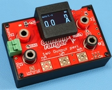

## Welcome to EmSys Autumn 2021 CSC368/M68
Welcome to the Swansea University EmSys (Embedded Systems) module. 
This repository contains various useful bits and pieces for the course, such as a schedule, datasheets, and various other things.
For this course, I will primarily use GitHub to host lecture and lab content. Below is a table detailing the lecture and labs' timing, along with links to the relevant GitHub page. Most of the repositories are currently private but will be made public before the appropriate lab/lecture. 

### Lab and Coursework Breakdown
|            | Lab description                                                                | Assessment type   | Overall weighting | Pairs/Individual |
|------------|--------------------------------------------------------------------------------|-------------------|-------------------|------------------|
| Lab 1      | [Secret Word](https://github.com/STFleming/EmSys_21A_lab1)                     | Signoff           | 2%                | Lab pairs        |
| Lab 2      | [Arduino introduction and dotDevice](https://github.com/STFleming/EmSys_21A_lab2)  | Signoff           | 3%                | Lab pairs        |
| Lab 3      | [GPIO deep dive](https://github.com/STFleming/EmSys_21A_lab3)                  | Signoff           | 5%                | Lab pairs        |
| Lab 4      | [Verilog Lab: designing an ALU](https://github.com/STFleming/emsys_21A_lab4)   | Signoff           | 5%                | Lab pairs        |
| Lab 5      | [ESP32 Hardware Timers and Verilog Timers](https://github.com/STFleming/emsys_21A_lab5)                                            | Signoff           | 5%                | Lab pairs        |
| CW 1       | [Low-power IoT sensor](https://github.com/STFleming/emsys_21A_cw)                   | Individual report | 30%               | Lab pairs        |

* All the lab work is completed in pairs. Pairing will be determined at the start of term.
* A "Signoff" assessment type means that I will look over your GitHub repository and check that the task has been completed and then update the marks. 
* An "Individual report" assessment type means that each student will need to submit an individual report for marking, where feedback is returned within 2 weeks. These larger assignments will be submitted via canvas. 

### Lab/CW Schedule 

|  Lab/CW                                | Release date       | Due Date          |
|----------------------------------------|--------------------|-------------------|
|  Lab 1                                 | 05/10/2021         | 25/10/2021 @ 11am |
|  Lab 2                                 | 11/10/2021         | 25/10/2021 @ 11am |
|  Lab 3                                 | 18/10/2021         | 25/10/2021 @ 11am |
|  Lab 4                                 | 26/10/2021         | 22/11/2021 @ 11am |
|  Lab 5                                 | 05/11/2021         | 22/11/2021 @ 11am |
|  CW 1                                  | 08/11/2021         | 08/12/2021 @ 11am |

### Exams
There a 50% exam component for this module. 

__A practice exam can be found [[here](https://github.com/STFleming/EmSysPracticeExam)]__ along with videos explaining the answers to the questions.

_Some components in the module this term have changed slightly, closer to the exam I will add additional practice questions for the additional content on the module._

### Useful links
* Setting up your EmSys lab environment [[here](https://github.com/STFleming/EmSys_labSetup)]
* Using your github logbook [[video](https://www.youtube.com/watch?v=YTgEFzmuQWE)]

-----------------------------------------------------------------------------------
### Lecture Schedule and Course Content (subject to change)
| Week  | dates       | Lecture 			                                                          | 				                                                                                     | 
|-------|-------------|-------------------------------------------------------------------------------------------|------------------------------------------------------------------------------------------------------------------|
| 1     |  30/09   |  [[Introduction to the course](https://github.com/STFleming/EmSys_21A_Lecture1)]                               |                                                 |
| 2     |  7/10    |  [[HW/SW](https://github.com/STFleming/EmSys_21A_Lecture2)]                               |                                                 |
| 3     |  14/10    | [[GPIO and the cost of the Arduino abstractions](https://github.com/STFleming/EmSys_GPIO_and_Abstraction_Costs)]                               |                                                 |
| 4     |  21/10    | [[Hardware Description Languages](https://github.com/STFleming/EmSys_Hardware_Description_Languages)]                               |                                                 |
| 5     |  28/10    | [[Synchronous Sequential Logic](https://github.com/STFleming/EmSys_Sequential_Logic)]                          |                                                 |
| 6     |   -    | -    |                                                 |

### Lecture Recordings
| Week  | dates       |  Recording                                                                                |
|-------|-------------|-------------------------------------------------------------------------------------------|
| 1     |  30/09      | [[video](https://swanseauniversity.zoom.us/rec/share/z19jZZvR1iy7D_5DGU_HRE2N8n-xzmR4a5qG0sIhJAAkmrto7c68r5DbLlyQNWRq.nEJyq6mEGpcsFsVJ)]                                                                                           |          
| 2     |  07/10      | [[video](https://swanseauniversity.zoom.us/rec/share/XfrZWC1erWqmQWKa6U2qrkDwb2RJjzE9alv8ozRDvDWq0-nu-ps9QDmcYraAxltS.-zQx4cnKkFVtY-e8?startTime=1633610700000)]                                                                                           |          
| 3     |  14/10      | [[video](https://swanseauniversity.zoom.us/rec/play/A8RBclaX4TlrNoBCyfGxA9FXxaHdIP6-GjN7PJHwRoL8x9hDiV-yap2nf_K5txCV9KRnI9IjlwD638LV.DTG_IWEC32C_jvtH?startTime=1634215328000)]                                                                                           |          
| 4     |  21/10      | [[video](https://swanseauniversity.zoom.us/rec/play/jRNhaI29sOGrarpnjqEhOeSkZzyyxDSETOonRDHR0clws2s4De9hyjkORMdXi9olymIX8Pqpyf9FkBHc.Yk9F0Au2HPSdEjWs?startTime=1634818658000)]                                                                                           |          
| 5     |  28/10      | [[video](https://swanseauniversity.zoom.us/rec/share/7txON84ZVY0688wAaKXllfzzdBwpQettMSOYITK_cQepj_Cti0BxICs0g7-3f9c.-5zbg0tQLBfVHhU3)]                                                                                           |          
| 6     |  9/11      | [[video](https://youtu.be/XMJrXcN7FpA)]                                                                                           |          
| 7     |  11/11      | [[video](https://swanseauniversity.zoom.us/rec/share/MM5dIhzFpzNkK1BrvSo1iT7E3kMMqxq0SPNj5jOTINHxXEgwXbCSLUXbfnt4PVuh._oo4GiNZ9BaiTMFz?startTime=1636638716000)]                                                                                           |          

-----------------------------------------------------------------------------------
### Datasheets & Technical Reference Manuals
| Device                       | Datasheet/Technical Reference Manual                                                                                                               |
|------------------------------|----------------------------------------------------------------------------------------------------------------------------------------------------|
|        | [TinyPico-01](https://www.tinypico.com/ )                                                                                                                                   |
|     | [ESP32 Technical Reference Manual](https://www.espressif.com/sites/default/files/documentation/esp32_technical_reference_manual_en.pdf)            |
|  | [Logic Analyser](https://cdn.shopify.com/s/files/1/1509/1638/files/Logic_Analyzer_Datasheet_e6569a64-4910-4661-9ef3-f431019ab753.pdf?v=1610445451) |
|  | [Low Power Current Amplifier](https://lowpowerlab.com/guide/currentranger/specs-architecture/) |

### TinyPico Pinout

-----------------------------------------------------------------------------------

### Software & Libraries
|  Software   |   Information / Resources  |
|-------------|----------------------------|
|  | [Basic Info](https://www.arduino.cc/en/Tutorial/BuiltInExamples) |
|  | [PulseView Logic Analyser gui](https://sigrok.org/wiki/PulseView) |
|     | [CircuitJs Web simulator](https://www.falstad.com/circuit/circuitjs.html) |
|     |  [ArduinoWebsockets](https://github.com/gilmaimon/ArduinoWebsockets) |
